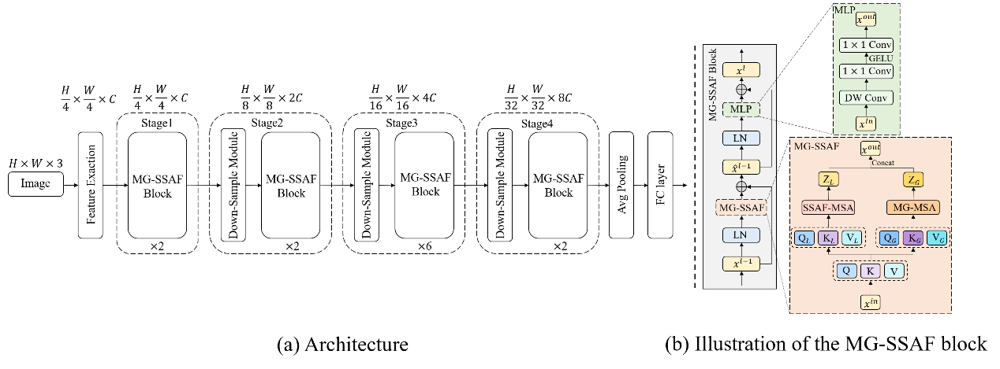

# MG-SSAF

This repo is the implementation of ["MG-SSAF: An advanced vision Transformer"]. The code of this project is modified and developed based on Swin Transformer.


## Introduction

**MG-SSAF** is a novel Vision Transformer backbone architecture designed to address cross-window feature interaction 
and high computational complexity for visual recognition tasks. It proposes a Space-wise Separable Multi-head 
Self-attention (SS-MSA) mechanism to reduce the computational complexity further. Then, an extra Attention Fusion 
Module (AF Module) is introduced for the attention weights in SS-MSA to enhance the representation ability of 
the similarity. Next, a Multi-scale Global Multi-head Self-attention (MG-MSA) method is presented to perform the 
global feature interaction. Moreover, It proposes to perform the window-based MSA and the global MSA simultaneously 
in one attention module to realize local feature modeling and global feature interaction. The experimental results 
demonstrate that the MG-SSAF achieves superior performance with fewer parameters and lower computational complexity. 



## Main Results

**ImageNet-1K  (val)**

| name |  pretrain   | resolution | acc@1 | #params  | FLOPs | FPS | 1K model |
| :--- |:-----------:|:----------:|:-----:|:--------:|:-----:|:---:|:--------:|
| MG-SSAF-T | ImageNet-1K |  224x224   | 81.9  |  19.6M   | 3.1G  | 789 | [Google](https://drive.google.com/file/d/1pqzUHH3RxBoRcWjVyM7U-E20BRZqgDcH/view?usp=sharing) |
| MG-SSAF-S | ImageNet-1K |  224x224   | 82.7  |  32.5M   | 5.6G  | 502 | [Google](https://drive.google.com/file/d/1c1zMzzBUCgQCKDPU7TwK7N0L_kOckR4T/view?usp=sharing) |
| MG-SSAF-B | ImageNet-1K |  224x224   | 83.2  |  55.8M   | 9.8G  | 317 |          |


**ADE20K Semantic Segmentation (val)**

| Backbone  | Method  |  pretrain   | Crop Size | Lr Schd | mIoU | mIoU (ms+flip) | #params | FLOPs |
|:---------:|:-------:|:-----------:|:---------:|:-------:|:----:|:--------------:|:-------:|:-----:|
| MG-SSAF-T | UPerNet | ImageNet-1K |  512x512  |  160K   | 44.7 |      46.2      |   50M   | 947G  |
| MG-SSAF-S | UperNet | ImageNet-1K |  512x512  |  160K   | 46.6 |      48.7      |   63M   | 1011G |
| MG-SSAF-B | UperNet | ImageNet-1K |  512x512  |  160K   | 47.8 |      49.8      |   88M   | 1034G |


**CUB Fine-Grained Classification (val)**

| Backbone  | #params | FLOPs |   acc@1    |
|:---------:|:-------:|:-----:|:----------:|
| MG-SSAF-T |  18.5M  | 12.4G |   87.49    |
| MG-SSAF-S |  31.4M  | 22.3G |   87.42    |
| MG-SSAF-B |  54.8M  | 39.5G |   85.11    |


## Getting Started
### Install


- Clone this repo:

```bash
git clone https://github.com/shuaiyang11/MG-SSAF.git
cd MG-SSAF
```

- Create a conda virtual environment and activate it:

```bash
conda create -n MGSSAF python=3.8 -y
conda activate MGSSAF
```

- Install `CUDA>=10.2` with `cudnn>=7` following
  the [official installation instructions](https://docs.nvidia.com/cuda/cuda-installation-guide-linux/index.html)
- Install `PyTorch>=1.8.0` and `torchvision>=0.9.0` with `CUDA>=10.2`:

```bash
conda install pytorch==1.8.0 torchvision==0.9.0 cudatoolkit=10.2 -c pytorch
```

- Install `timm==0.4.12`:

```bash
pip install timm==0.4.12
```

- Install other requirements:

```bash
pip install opencv-python==4.4.0.46 termcolor==1.1.0 yacs==0.1.8 pyyaml scipy
```


### Data preparation

We use standard ImageNet dataset, you can download it from http://image-net.org/. We provide the following ways to
load data:

- For standard folder dataset, move validation images to labeled sub-folders. The file structure should look like:
  ```bash
  $ tree data
  imagenet
  ├── train
  │   ├── class1
  │   │   ├── img1.jpeg
  │   │   ├── img2.jpeg
  │   │   └── ...
  │   ├── class2
  │   │   ├── img3.jpeg
  │   │   └── ...
  │   └── ...
  └── val
      ├── class1
      │   ├── img4.jpeg
      │   ├── img5.jpeg
      │   └── ...
      ├── class2
      │   ├── img6.jpeg
      │   └── ...
      └── ...
 
  ```


### Evaluation

To evaluate a pre-trained `MG-SSAF` on ImageNet val, run:

```bash
python -m torch.distributed.launch --nproc_per_node <num-of-gpus-to-use> --master_port 12345 main.py --eval \
--cfg <config-file> --resume <checkpoint> --data-path <imagenet-path> 
```

For example, to evaluate the `MG-SSAF-T` with a single GPU:

```bash
python -m torch.distributed.launch --nproc_per_node 1 --master_port 12345 main.py --eval \
--cfg configs/MG-SSAF/MG-SSAF-T.yaml --resume MG-SSAF-T.pth --data-path <imagenet-path>
```

### Training from scratch on ImageNet-1K

To train a `MG-SSAF` on ImageNet from scratch, run:

```bash
python -m torch.distributed.launch --nproc_per_node <num-of-gpus-to-use> --master_port 12345  main.py \ 
--cfg <config-file> --data-path <imagenet-path> [--batch-size <batch-size-per-gpu> --output <output-directory>]
```


For example, to train `MG-SSAF` with 2 GPUs on a single node for 300 epochs, run:

`MG-SSAF-T`:

```bash
python -m torch.distributed.launch --nproc_per_node 2 --master_port 12345  main.py \
--cfg configs/MG-SSAF/MG-SSAF-T.yaml --data-path <imagenet-path> --batch-size 128 
```

`MG-SSAF-S`:

```bash
python -m torch.distributed.launch --nproc_per_node 2 --master_port 12345  main.py \
--cfg configs/MG-SSAF/MG-SSAF-S.yaml --data-path <imagenet-path> --batch-size 128 
```

`MG-SSAF-B`:

```bash
python -m torch.distributed.launch --nproc_per_node 2--master_port 12345  main.py \
--cfg configs/MG-SSAF/MG-SSAF-B.yaml --data-path <imagenet-path> --batch-size 64 \
--accumulation-steps 2 [--use-checkpoint]
```


## Citing MG-SSAF

```
@inproceedings{liu2021Swin,
  title={MG-SSAF: An advanced vision Transformer},
  author={Shuai Yang, Chunyan Hu, Lin Xie, Feifei Lee, Qiu Chen},
  booktitle={},
  year={2025}
}
```
